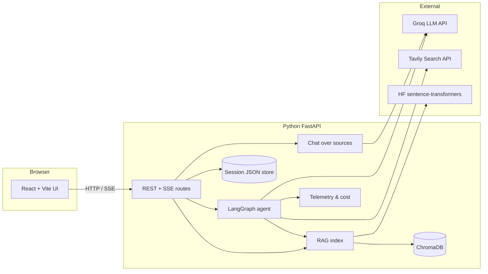
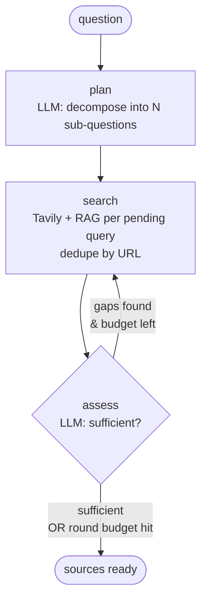
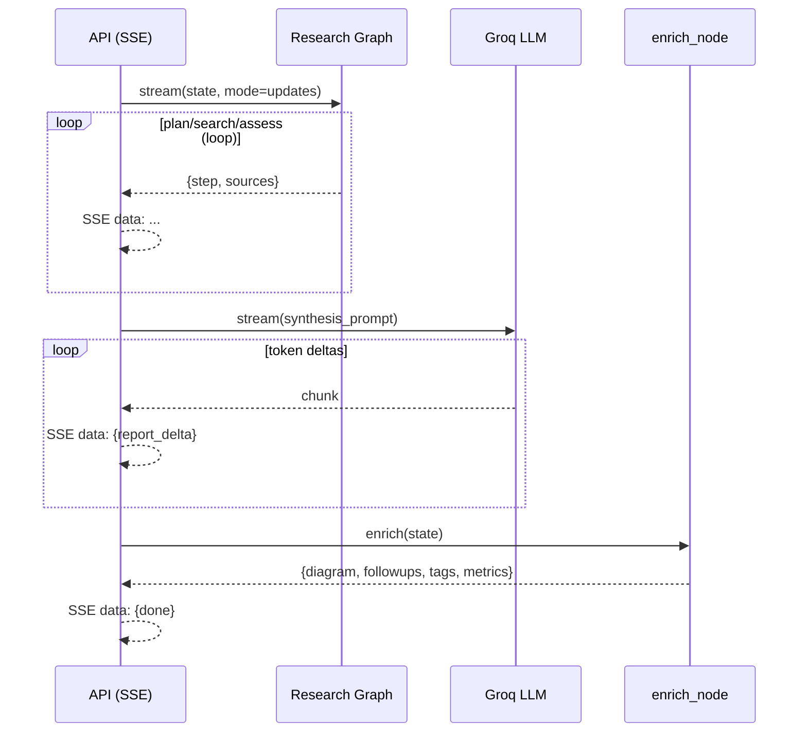
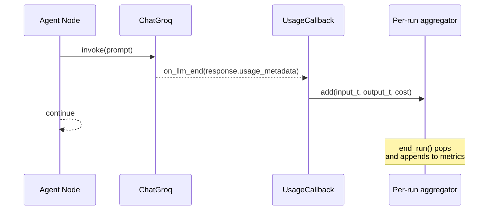
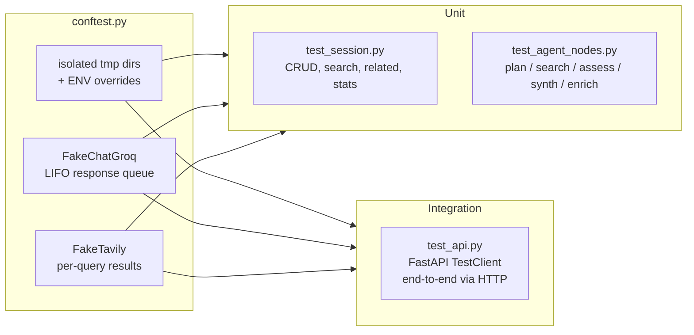

# Architecture

A design-focused companion to [README.md](README.md). Explains **what the
pieces are, how they fit, and why the tradeoffs came out this way** —
written so someone unfamiliar with the codebase can grok the system in
ten minutes.

---

## System topology



---

## The research pipeline

The interesting part. Two graphs cooperate.

### Graph 1: `build_research_agent` — plan + search + assess loop



- **Termination is guaranteed** by `MAX_ROUNDS` — even if the assessor
  keeps flagging gaps forever, the loop can't run more than N times.
- **Deduplication** happens at the URL level in the search node, so
  loops don't pile up the same source.
- **RAG is transparent** — hits from ChromaDB flow into the same source
  list, tagged `source_type: "document"` so the UI can badge them.

### Graph 2: streaming synthesis, driven outside the graph



Why split it? LangGraph nodes are atomic — you can't easily yield
tokens **from inside** a node while the graph is running. So the graph
runs up to "coverage sufficient", `stream_research()` then streams
synthesis manually with `llm.stream()`, then runs the enrich node.

---

## Key design decisions

### Why LangGraph over plain LangChain chains
- **Cycles**: the "search until sufficient" loop is the whole point;
  chains are DAGs.
- **Explicit state**: the `ResearchState` TypedDict is the contract
  between nodes; easy to unit-test one node in isolation with a stub
  state (see [tests/test_agent_nodes.py](tests/test_agent_nodes.py)).
- **Deterministic routing**: `route_after_assess` is pure and testable.

### Why streaming synthesis outside the graph
LangGraph's `stream()` yields **per-node updates**, not intra-node
token deltas. Streaming synthesis inside a node would require a
callback + queue plumbing that isn't worth the complexity. Splitting
into a research-only graph + external synthesis kept the graph pure and
the streaming code obvious.

### Why JSON files for sessions instead of SQLite
- One file per session, atomic writes, fully diffable, zero migration
  cost, trivial to inspect during development.
- Sessions are read-mostly, single-user for a portfolio project. SQLite
  would be overkill and add a build-time schema.
- The `session.py` module exposes CRUD-style helpers so swapping to a
  real DB later is a 40-line change.

### Why ChromaDB (not FAISS / pgvector)
- Persistent by default with no separate server process.
- First-class LangChain integration via `langchain-chroma`.
- Free tier of embedding via `sentence-transformers` (MiniLM) keeps the
  demo runnable without an OpenAI key.

### Why Groq for LLM
- Latency: streaming synthesis feels immediate at ~250 tok/s.
- Cheap enough that eval runs cost cents, not dollars.
- Compound-mini is small enough for planning/critique; Llama-3.3-70B
  falls back for the harder synthesis.

### Why SSE (not WebSockets)
- One-way stream, server -> browser, fits the model perfectly.
- No client library needed — `EventSource` is built into every browser.
- Survives HTTP proxies more cleanly than websockets.

### Why React + Vite (not Next.js)
- Zero server needs on the frontend; it's a static SPA that talks to
  FastAPI. Deploying is `vite build` + serve `dist/`.
- Vite HMR is instant and Tailwind JIT compiles cold in <1s.

### Feature flags for gradual capability degradation
- `ENABLE_RAG` off → RAG code path is skipped without erroring.
- `ENABLE_CREW` off → CrewAI mode is hidden in the UI and its endpoint
  returns 400.
- `GROQ_API_KEY` missing → `config.validate()` raises early with a
  user-friendly `RuntimeError` that surfaces to the API as HTTP 400.

---

## Telemetry & cost

Every LLM call flows through a LangChain `BaseCallbackHandler` in
[app/telemetry.py](app/telemetry.py):



The callback reads `AIMessage.usage_metadata`, prices it against a
per-model table baked into `telemetry._DEFAULT_PRICES`, and aggregates
per `run_id` in a `ContextVar`-scoped store.

Two additional outputs:

1. **Structured logs** — JSONL to stderr **and** to
   `data/telemetry/YYYY-MM-DD.jsonl`. Every line has stable fields
   `{ts, level, event, run_id, node, ...}`; grep-friendly, easy to ship
   to Loki later.
2. **Frontend metrics tile** — the API returns real
   `input_tokens / output_tokens / cost_usd / llm_calls` alongside
   duration and source counts; the UI renders them in the metrics bar.

---

## Testing strategy



- **No network calls in the suite.** Every LLM invocation goes through
  `FakeChatGroq` which pops responses from a per-test queue. Every
  Tavily call goes through `FakeTavily` with a per-query dict of
  canned results.
- **Data is isolated per test** — `SESSIONS_DIR`, `UPLOADS_DIR`,
  `CHROMA_PERSIST_DIR` all point at pytest's `tmp_path`.
- **`MAX_ROUNDS=1`** in tests to keep the loop deterministic.

Run:
```powershell
.\.venv\Scripts\python.exe -m pytest
```

---

## Evals

Separate from unit tests. [`evals/run_eval.py`](evals/run_eval.py) runs
the **real** agent against real APIs and scores each report with an LLM
judge on five 0-5 rubrics (coverage / citations / groundedness /
clarity / honesty). See [evals/README.md](evals/README.md).

Cheap enough to run in CI on a merge to `main` (a few cents per full
sweep with Compound-mini).

---

## Trade-offs & known gaps

| Chose                             | Trade-off                                                |
|-----------------------------------|----------------------------------------------------------|
| JSON files for sessions           | Won't scale past ~10k sessions; no concurrent writes     |
| ChromaDB embedded                 | No horizontal scale; fine for single-user demo           |
| SSE unidirectional stream         | Can't pause/rewind synthesis; would need WebSockets      |
| Groq only (LangGraph mode)        | Ties to one provider; the `_llm()` fallback chain is stubby |
| Client-side pricing table         | Drifts when Groq changes prices; override via env vars   |
| No auth                           | Local single-user only; add a simple bearer token to ship |
| No observability backend          | Logs are JSONL to disk; would ship to Loki in production |
| Streamlit legacy UI still shipped | Adds ~200MB to deps; keep it or delete once React ships  |

None of these are blockers for a portfolio demo. Each has a two-hour
upgrade path if the project graduates to production.

---

## Where to look for what

| I want to…                                | Read this                                           |
|-------------------------------------------|-----------------------------------------------------|
| Understand the agent loop                 | [app/agent.py](app/agent.py) — `build_research_agent` |
| See what a node returns                   | [tests/test_agent_nodes.py](tests/test_agent_nodes.py) |
| Add a new report template                 | `TEMPLATES` in [app/agent.py](app/agent.py)          |
| Add a new API endpoint                    | [app/api.py](app/api.py)                            |
| Add a UI component                        | [frontend/src/components/](frontend/src/components/) |
| Track LLM tokens / cost                   | [app/telemetry.py](app/telemetry.py)                |
| Measure the agent's quality               | [evals/run_eval.py](evals/run_eval.py)              |
| Change loop budgets                       | `MAX_ROUNDS` / `MAX_SUBQUESTIONS` in [app/config.py](app/config.py) |
