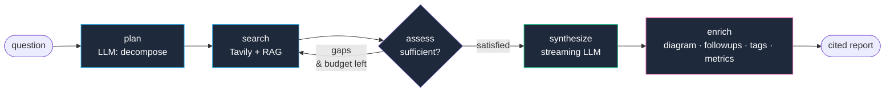

<div align="center">

# 🔎 Deep Research Agent

### An autonomous AI research assistant that plans, searches, critiques, and writes cited reports — all streamed live to a modern React UI.

<br>

[](https://github.com/Sanchitaccenture/deep-research-agent/actions/workflows/ci.yml)
[](LICENSE)
[](https://www.python.org/)
[](https://react.dev/)
[](https://fastapi.tiangolo.com/)
[](https://www.typescriptlang.org/)
[](tests/)

<br>

### 🌐 **[Try it live — deep-research-agent-henna.vercel.app →](https://deep-research-agent-henna.vercel.app)**

**[Docs](https://deep-research-agent-production-6f9a.up.railway.app/docs)** &nbsp;·&nbsp;
**[Architecture](ARCHITECTURE.md)** &nbsp;·&nbsp;
**[Deploy Guide](DEPLOY.md)** &nbsp;·&nbsp;
**[Tests](tests/)** &nbsp;·&nbsp;
**[Evals](evals/)**

<br>

<sub>Deployed on Railway (backend) + Vercel (frontend) · Docker · CI on GitHub Actions</sub>

</div>

---

## ✨ Why this exists

Most "AI research" tools are thin wrappers around a single LLM call. This project shows what happens when you go further:

- an **agentic state machine** that plans, searches, self-critiques and loops until coverage is sufficient
- **grounded retrieval** over both the live web and your own uploaded documents
- **real-time streaming synthesis** — the report writes itself token-by-token with a caret
- **production-grade engineering** — full test suite, LLM-as-judge evals, per-run cost tracking, structured telemetry, graceful degradation on rate limits

It behaves like a junior analyst you can ask any question at 2am.

---

## 🖼️ In action

The dashboard, ⌘K command palette, streaming synthesis, mind map, and follow-up chat:

**[▶ Open the live demo](https://deep-research-agent-henna.vercel.app)** &nbsp;·&nbsp; Try the sample questions on the home screen for a quick feel.

> Screenshots and a 90-second Loom walkthrough will be added here in the next commit.

---

## 🧠 How it works

Two graphs cooperate under the hood:



**Termination is guaranteed** — the round budget (`MAX_ROUNDS`) hard-caps the assess/search loop. **Streaming synthesis** happens outside the graph so the LLM's tokens can flow directly to SSE events without the atomic-node constraint of LangGraph.

See [ARCHITECTURE.md](ARCHITECTURE.md) for full design decisions, sequence diagrams, and trade-off analysis.

---

## 🚀 Features

<table>
<tr>
<td width="50%" valign="top">

### 🤖 AI pipeline

- **LangGraph state machine** with conditional routing and guaranteed loop termination
- **RAG over user documents** — ChromaDB + `sentence-transformers` (MiniLM), works offline
- **Token-by-token streaming synthesis** — no more blank-screen waits
- **5 report templates** — Standard, Executive, Deep Dive, Pros/Cons, Timeline
- **Auto-generated Mermaid mind maps** — one per report
- **Follow-up chat** grounded in the same numbered sources
- **LLM-suggested tags** + follow-up questions after every run
- **Runtime model fallback** — hits any Groq rate limit / decommissioned model? Transparent switch to the next in the chain
- **Graceful degradation** — if every model is exhausted, the run still returns a source-only report with citations

</td>
<td width="50%" valign="top">

### 🎨 Frontend UX

- **Home dashboard** with stats, activity chart, popular tags, recent + bookmarked sessions
- **Command palette (⌘K)** with fuzzy search across sessions, templates, actions
- **Query autocomplete** — Tab to accept recent or suggested prompts
- **Voice input** — Web Speech API microphone on every input
- **Focus mode** — distraction-free full-screen reader (+/- to resize)
- **Auto-generated Table of Contents** — sticky rail, scroll-sync active heading
- **Enhanced sources panel** — favicons, domain chips, search + inline highlighting, expand-in-place
- **Bookmarks + hashtags + autosaving notes** on every session
- **Toast notifications** for every action
- **Shareable URLs** — `#/session/<id>` deep-links back to any run
- **Error boundary** + **SSE reconnect** with exponential backoff

</td>
</tr>
<tr>
<td width="50%" valign="top">

### 🛠️ Engineering rigour

- **55 pytest cases** — mocked LLM + Tavily, isolated per-test data dirs, runs offline in <5s
- **LLM-as-judge evals** — scores every report on 5 rubrics (coverage / citations / groundedness / clarity / honesty)
- **Structured telemetry** — every LLM call captured via LangChain callback, JSONL logs to `data/telemetry/YYYY-MM-DD.jsonl`
- **Real token + USD cost tracking** — surfaced in the metrics tile per run
- **CI on GitHub Actions** — pytest matrix (Python 3.12 + 3.13) + frontend build on every push
- **Dockerized backend** with health-check + persistent volume support
- **Response cache** with TTL for identical questions
- **In-memory per-IP rate limiter** with `X-Forwarded-For` awareness

</td>
<td width="50%" valign="top">

### 🚢 Operations

- **Real /health endpoint** — dependency checks (Groq key, Tavily key, sessions dir, ChromaDB) return `ok` / `degraded` / `error`
- **Server-sent events** for step / source / report-delta / diagram / followup / tag / metric updates
- **Persistent JSON session store** with search, related-sessions, and aggregate stats endpoints
- **Feature flags** for graceful degradation — disable RAG or Crew without breaking anything
- **Zero external observability deps** — grep-friendly JSONL logs, ready to ship to Loki
- **Ephemeral-safe** — sessions + Chroma + HF cache all live under `/app/data`, one volume mount and you have persistence

</td>
</tr>
</table>

---

## 🧰 Tech stack

<table>
<tr>
<td valign="top" width="33%">

**Backend**

`Python 3.12+`
`FastAPI`
`LangGraph`
`LangChain`
`Groq LLM API`
`Tavily Search API`
`ChromaDB`
`sentence-transformers`
`Pydantic`
`Uvicorn`

</td>
<td valign="top" width="33%">

**Frontend**

`React 18`
`TypeScript 5.5`
`Vite 5`
`TailwindCSS 3`
`react-markdown` + `remark-gfm`
`Mermaid 11`
`Web Speech API`
`Server-Sent Events`

</td>
<td valign="top" width="33%">

**Infra & tooling**

`Docker`
`Railway`
`Vercel`
`GitHub Actions`
`pytest`
`LLM-as-judge evals`
`JSONL structured logging`

</td>
</tr>
</table>

---

## ⚡ Quick start

You'll need two free API keys:

- **Groq** — <https://console.groq.com/keys>
- **Tavily** — <https://app.tavily.com> *(free 1000 searches/month)*

### Option A — Docker (one command)

```bash
cp .env.example .env    # fill in the two keys
docker compose up --build
```

Open <http://localhost:5173>.

### Option B — Native

```powershell
# Backend
python -m venv .venv
.\.venv\Scripts\activate
pip install -r requirements.txt
copy .env.example .env       # paste your two keys
python -m uvicorn app.api:app --reload --port 8000

# Frontend (new terminal)
cd frontend
npm install
npm run dev
```

Open <http://localhost:5173>.

---

## 🧪 Testing & evaluation

```powershell
# 55 unit + API tests — offline, mocks LLM + Tavily, ~3 seconds
python -m pytest

# End-to-end quality evals — real APIs, ~5-10¢ per full sweep
python -m evals.run_eval
python -m evals.run_eval --ids rag-basics,mcp-security
```

Every run also emits a structured telemetry line to `data/telemetry/YYYY-MM-DD.jsonl`:

```json
{"ts":"2026-09-17T...","event":"llm.call","run_id":"a1b2...","node":"synthesize","model":"groq/compound-mini","input_tokens":1240,"output_tokens":812,"cost_usd":0.000368}
```

Grep-friendly, no external observability service required. See [evals/README.md](evals/README.md) for the rubric definitions.

---

## 🌍 Deployment

Both halves deploy in ~15 minutes each:

- **Backend → Railway** — auto-detected from the `Dockerfile`, health-checked at `/health`, persistent volume at `/app/data`
- **Frontend → Vercel** — Vite static build, `vercel.json` rewrites `/api/*` to the Railway URL, no env vars needed

Step-by-step click-through guide with env vars, CORS wiring, and rollback: **[DEPLOY.md](DEPLOY.md)**

---

## 📁 Project structure

```
deep-research-agent/
├── app/
│   ├── agent.py         # LangGraph pipeline + streaming synthesis + model fallback
│   ├── crew.py          # Native multi-agent crew (LangChain-based, no crewai dep)
│   ├── rag.py           # ChromaDB vector store + PDF/TXT ingestion
│   ├── chat.py          # Follow-up chat grounded in a session's sources
│   ├── session.py       # JSON-based session persistence + search + related + stats
│   ├── cache.py         # TTL cache for identical questions
│   ├── rate_limit.py    # In-memory per-IP sliding-window limiter
│   ├── middleware.py    # JSONL request logging
│   ├── telemetry.py     # LangChain callback for real token + USD tracking
│   ├── config.py        # Env-driven typed settings + directory bootstrap
│   └── api.py           # FastAPI: research, crew, docs, sessions, SSE, chat
├── frontend/
│   └── src/
│       ├── App.tsx
│       ├── components/  # ~30 components: Dashboard, CommandPalette,
│       │                # ResearchStage, ReportView, SourcesPanel, ChatPanel,
│       │                # NotesPanel, TableOfContents, FocusMode, MetricsBar,
│       │                # Toast, ErrorBoundary, Sidebar, ...
│       ├── hooks/       # useResearch, useChat, useHotkeys, useVoice
│       ├── lib/api.ts   # Typed API client
│       └── types.ts
├── tests/               # 55 pytest cases: nodes, session store, FastAPI routes
├── evals/               # LLM-as-judge harness + questions.yaml
├── .github/workflows/   # CI: pytest matrix + frontend build
├── ARCHITECTURE.md      # Design decisions, sequence diagrams, trade-offs
├── DEPLOY.md            # Railway + Vercel step-by-step
├── DEMO_SCRIPT.md       # 90-second Loom script (timed)
├── LINKEDIN_POST.md     # Draft LinkedIn post
├── Dockerfile
├── docker-compose.yml
├── railway.json
└── frontend/vercel.json
```

---

## 🔧 Configuration

Everything is env-driven — no code changes to tune.

| Variable | Default | What it does |
|---|---|---|
| `GROQ_API_KEY` | *(required)* | LLM provider key |
| `TAVILY_API_KEY` | *(required)* | Web search key |
| `GROQ_MODEL` | `groq/compound-mini` | Primary LLM; fallback chain kicks in if it's rate-limited |
| `MAX_SUBQUESTIONS` | `4` | Sub-questions per plan |
| `RESULTS_PER_SEARCH` | `4` | Tavily results per query |
| `MAX_ROUNDS` | `3` | Hard cap on the assess/search loop |
| `RAG_TOP_K` | `4` | Doc chunks retrieved per query |
| `EMBEDDING_MODEL` | `sentence-transformers/all-MiniLM-L6-v2` | Runs locally, no key needed |
| `ENABLE_RAG` | `true` | Toggle document search |
| `ENABLE_CREW` | `true` | Toggle multi-agent crew mode |
| `ALLOWED_ORIGINS` | `http://localhost:5173,http://127.0.0.1:5173` | CORS allowlist |
| `RATE_LIMIT_PER_MINUTE` | `30` | Set to `0` to disable |
| `RESEARCH_CACHE_TTL_SECONDS` | `900` | Cache for identical questions |

See [.env.example](.env.example) for the full list.

---

## 🗺️ Roadmap

- [ ] 90-second Loom demo linked at the top of the README
- [ ] Screenshot gallery
- [ ] Auth (bearer token) so it's safe to leave live long-term
- [ ] LangSmith trace integration (optional, feature-flagged)
- [ ] Streaming from more providers (OpenAI, Anthropic) with `LiteLLM`
- [ ] Postgres session store option (for horizontal scale)
- [ ] Native mobile responsive layout (currently desktop-first)

---

## 🙏 Acknowledgements

Built with genuinely wonderful open-source tools:

- **[LangGraph](https://github.com/langchain-ai/langgraph)** for the state machine
- **[Groq](https://groq.com/)** for absurdly fast LLM inference
- **[Tavily](https://tavily.com/)** for research-grade web search
- **[ChromaDB](https://www.trychroma.com/)** for embedded vector storage
- **[Mermaid](https://mermaid.js.org/)** for the auto-generated mind maps
- **[FastAPI](https://fastapi.tiangolo.com/)** + **[Vite](https://vitejs.dev/)** for a delightful DX

---

## 📄 License

MIT — see [LICENSE](LICENSE).

---

<div align="center">

**If this project taught you something or you'd like to work together —**

**⭐ Star the repo**  ·  **[Open the live demo](https://deep-research-agent-henna.vercel.app)**  ·  **[Open an issue](https://github.com/Sanchitaccenture/deep-research-agent/issues)**

<br>

<sub>Built by <a href="https://github.com/Sanchitaccenture">Sanchit</a> · 2026</sub>

</div>
